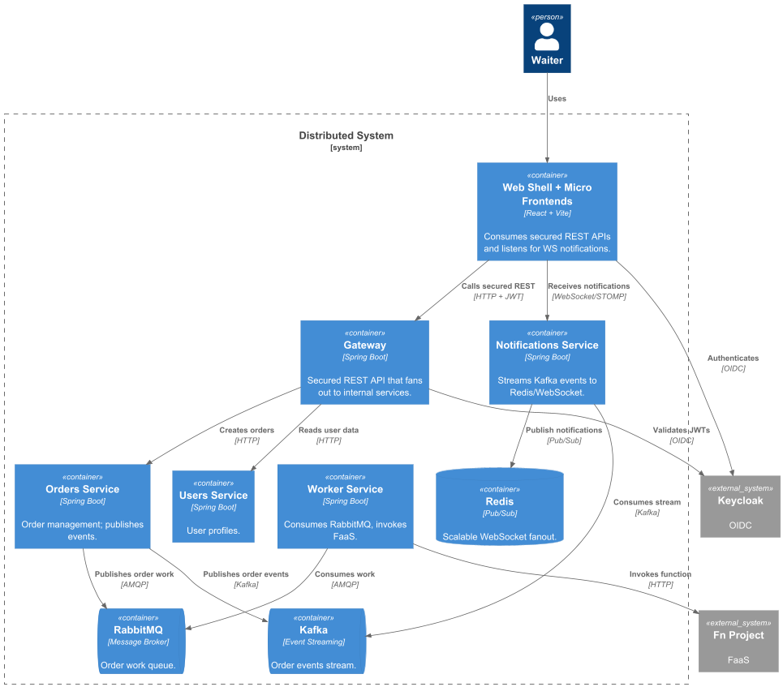

# Distributed System (SOA Project)

Event-driven restaurant order platform with a secured gateway, microservices,
FaaS audit, and micro-frontend UI.



## What this project does
- Waiters submit table orders in the Orders widget.
- Orders are created in the Orders service and events are published to RabbitMQ
  and Kafka.
- Worker consumes RabbitMQ messages and invokes a Fn function that writes audit
  records to Postgres.
- Notifications service consumes Kafka and pushes real-time updates to clients
  over WebSockets (with Redis pub/sub fan-out).
- Users service pulls user data from Keycloak.

## Architecture highlights
- Secured REST API via Gateway + Keycloak (JWT).
- Load balancing at the gateway using NGINX.
- Message broker: RabbitMQ.
- Event streaming: Kafka (Redpanda).
- FaaS: Fn Project (`order-fn`).
- Micro-frontends: Orders, Users, Notifications + Shell.
- Containers: Docker Compose.
- Documentation: C4 + UML/sequence diagrams in `docs/`.

## Services
- `gateway`: JWT-secured API entrypoint.
- `orders`: Order CRUD and event publisher.
- `users`: Reads users from Keycloak admin API.
- `worker`: Consumes RabbitMQ and invokes FaaS.
- `notifications`: Kafka → Redis → WebSocket updates.
- `keycloak`: Auth provider.
- `redis`, `rabbitmq`, `kafka`, `postgres`: infrastructure.
- `nginx`: load-balancing proxy for the gateway.
- `shell`, `orders-mf`, `users-mf`, `notifications-mf`: UI frontends.

## Run with Docker
1) Build backend services:
```
./gradlew :services:gateway:bootJar :services:orders:bootJar :services:users:bootJar \
  :services:notifications:bootJar :services:worker:bootJar
```
2) Start the stack:
```
docker compose -f deploy/docker-compose.yml up --build
```
3) Start Fn locally (host mode):
```
fn start --port 12345
```
4) Deploy the FaaS function:
```
export FN_API_URL=http://localhost:12345
fn deploy --app soa --local ./functions/fn/order-fn
```
5) Open the UI:
- Shell: http://localhost:5170

Default Keycloak users (password `demo`):
- `user1`, `user2`, `user3`

## Key endpoints
- Gateway API: `http://localhost/api`
- Keycloak: `http://localhost/keycloak`
- RabbitMQ UI: `http://localhost:15672`
- Shell: `http://localhost:5170`
